# Panel SOS — Guía de uso (Monitor)

> Sistema en `https://apisosgw.gvops.cl`. Para obtener credenciales, contacte al administrador.

## Iniciar sesión

Ingrese su usuario y contraseña, y pulse **Iniciar sesión**.

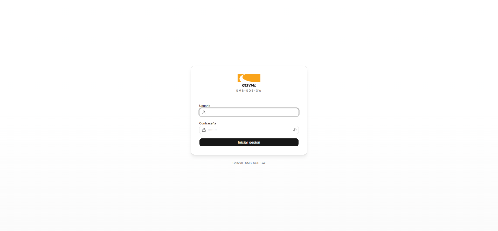

## Monitor en vivo

Esta es la pantalla principal: muestra el estado de cada poste, las pruebas en curso y la actividad reciente. La información se actualiza sola.

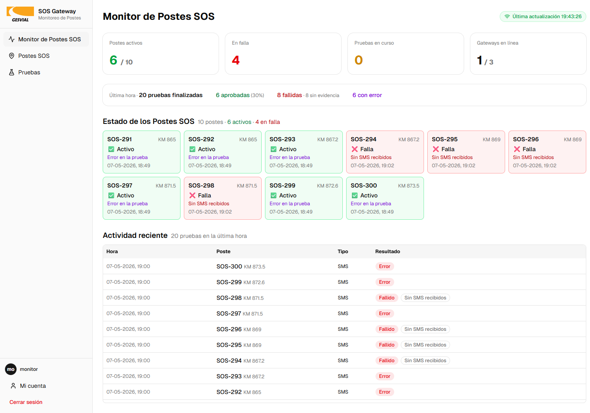

## Probar varios postes a la vez

Abra **Postes SOS** desde el menú lateral. Filtre por nombre, kilómetro o estado con la barra superior si lo necesita.

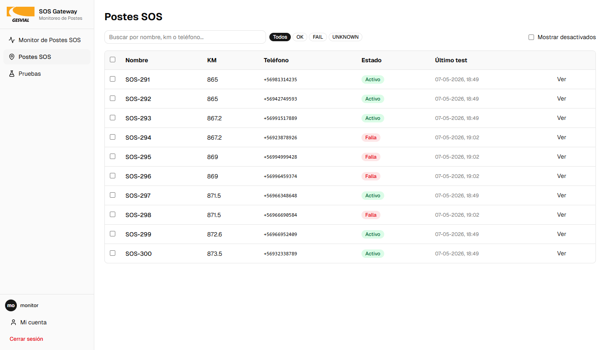

Marque las casillas de los postes a probar, despliegue el menú **Tipo de prueba** y elija el tipo (SMS, Conectividad, Audio).

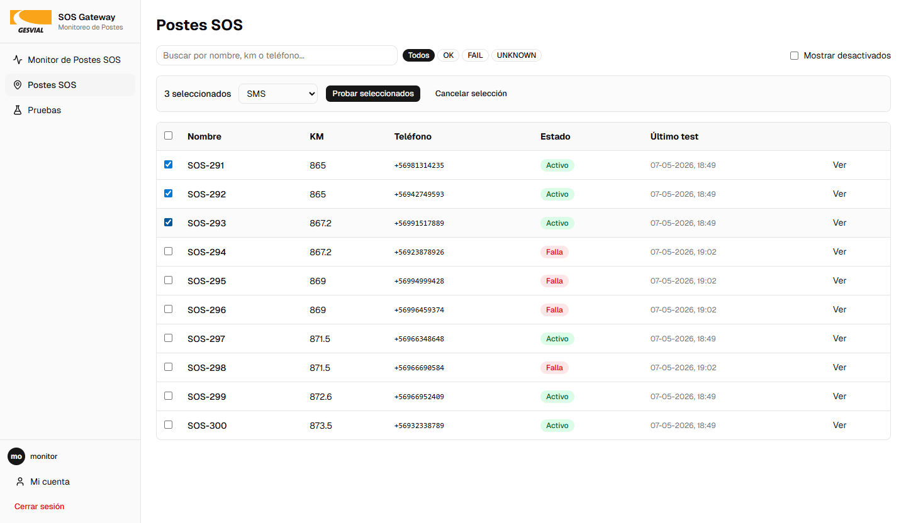

Pulse **Probar seleccionados** y confirme con **Enviar** en el diálogo.

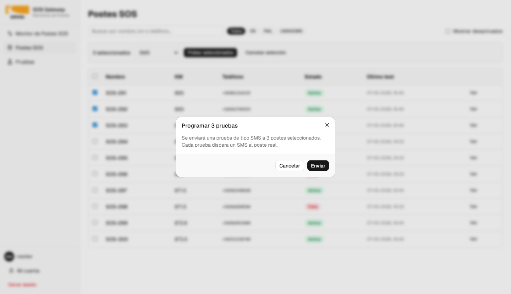

Aparece un mensaje con cuántas pruebas se crearon, cuáles ya estaban pendientes y cuántas fallaron al programarse.

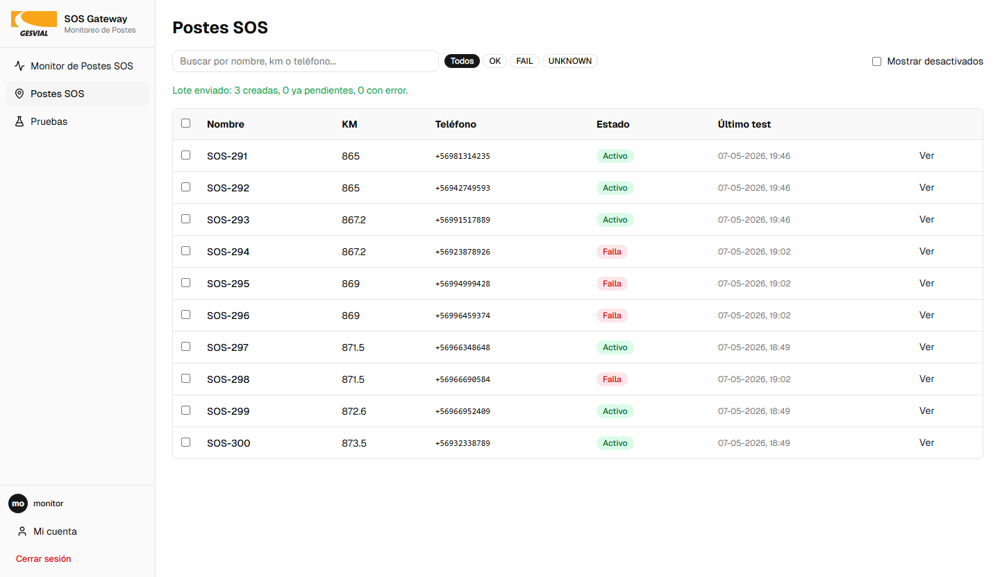

## Ejecutar una prueba a un poste específico

En **Postes SOS**, pulse **Ver** en la fila del poste para abrir su detalle.

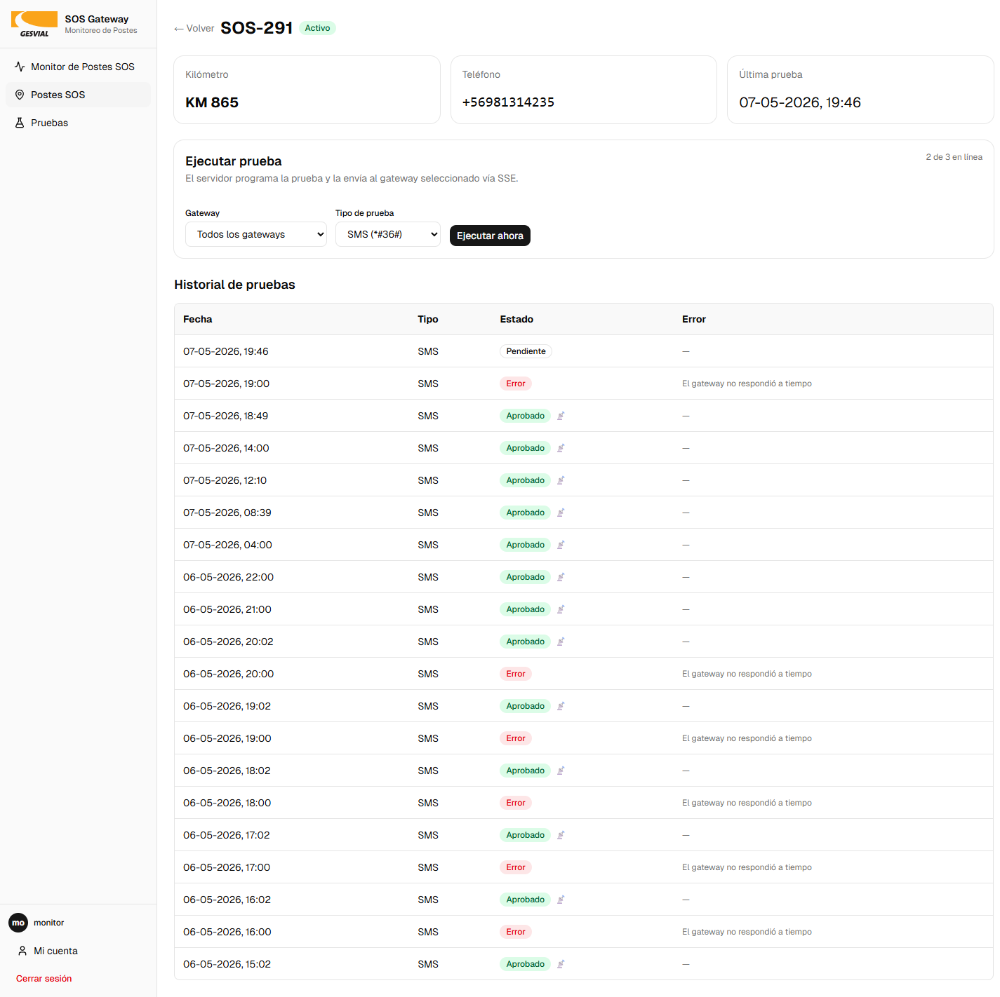

En la tarjeta **Ejecutar prueba**, seleccione el gateway (deje "Todos los gateways" si no está seguro) y el tipo de prueba, luego pulse **Ejecutar ahora**.

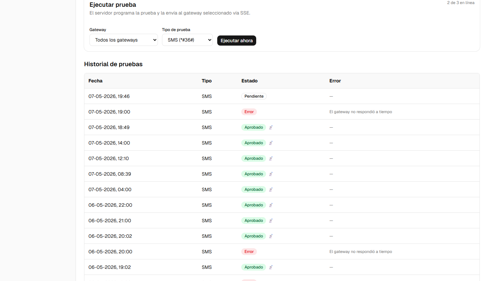

Si el poste ya tiene una prueba pendiente, pulse **Cancelar pendiente y reintentar** para descartarla y enviar una nueva.

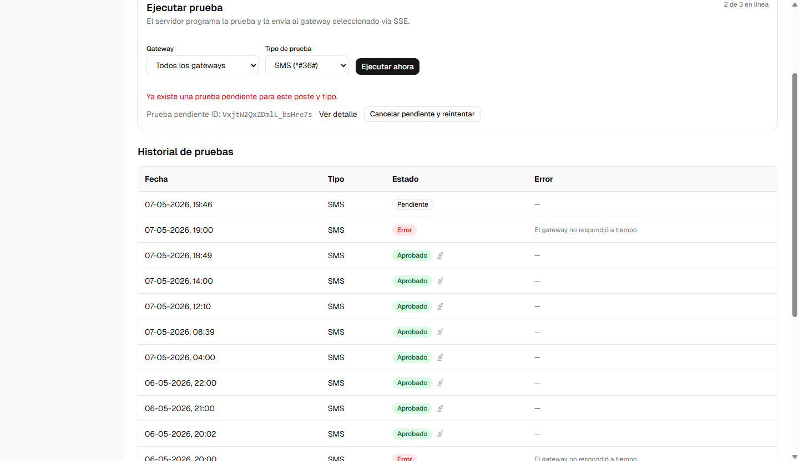

## Buscar pruebas históricas

Abra **Pruebas** desde el menú. Acote por tipo, estado, poste o rango de fechas usando los filtros superiores.

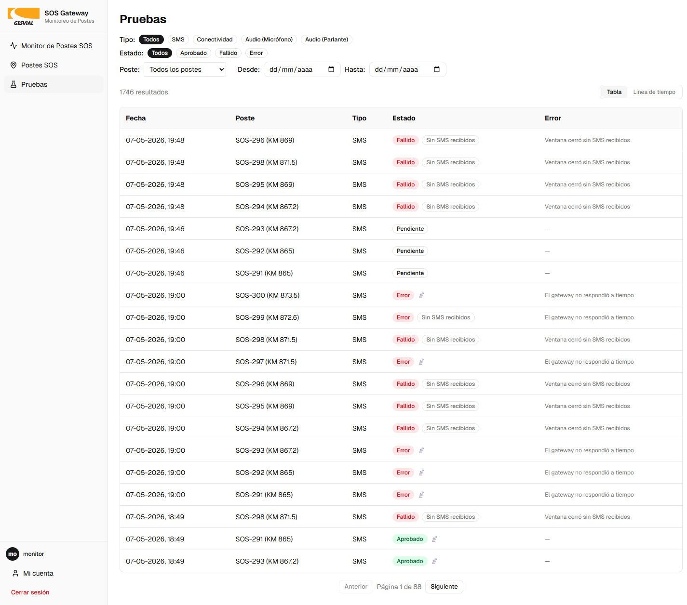

Para ver la secuencia temporal, pulse **Línea de tiempo** en la esquina superior derecha.

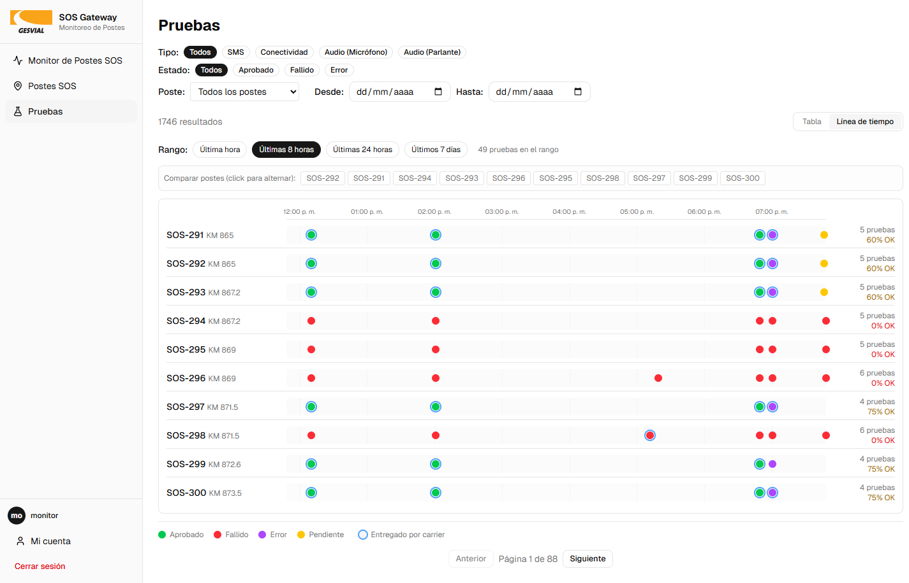

Pulse cualquier fila para ver el detalle completo de la prueba, incluyendo evidencia y JSON crudo.

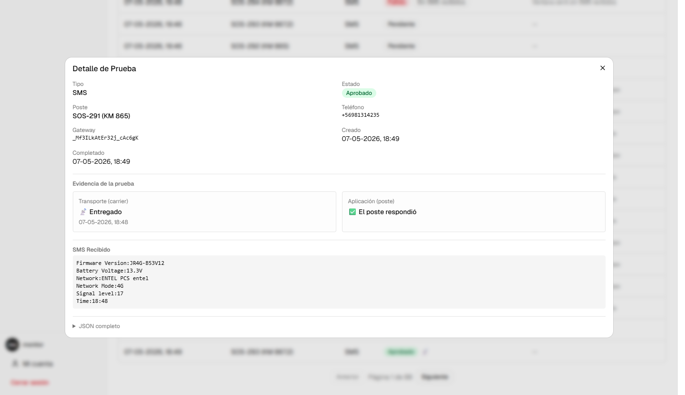

## Cambiar mi contraseña

Abra **Mi cuenta** desde el menú lateral. Ingrese su contraseña actual, la nueva (mínimo 8 caracteres) y la confirmación, luego pulse **Cambiar contraseña**.

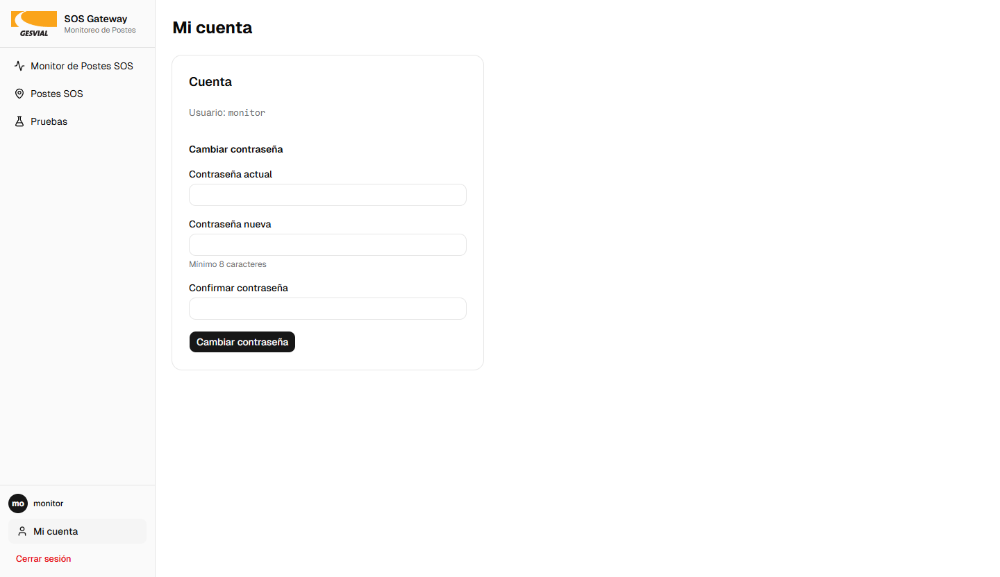
